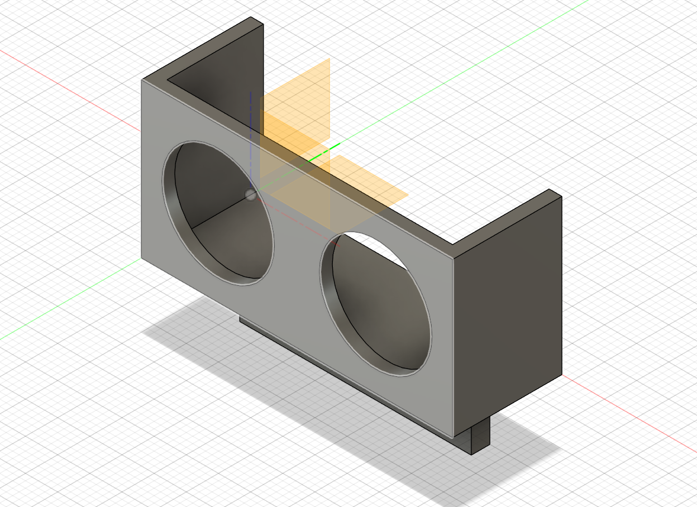
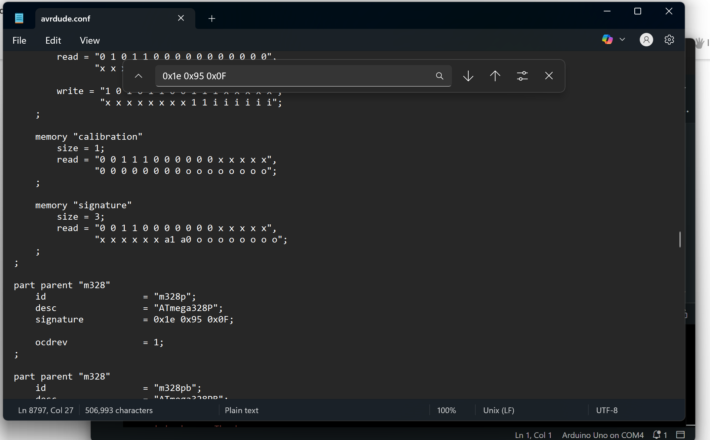
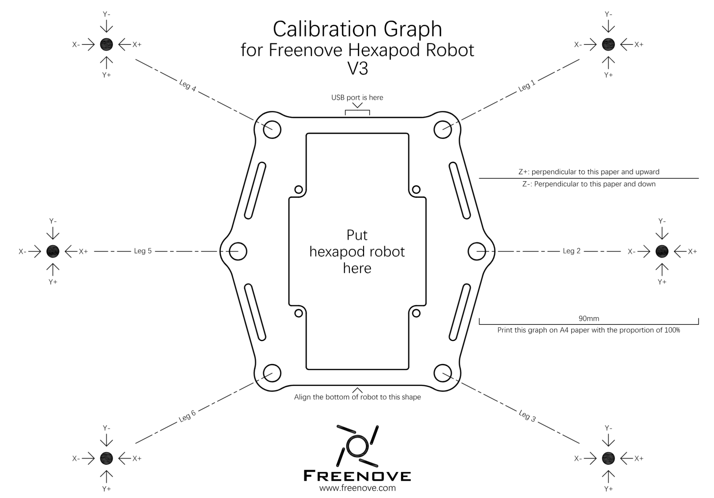

Hexapod
<!--- Replace this text with a brief description (2-3 sentences) of your project. This description should draw the reader in and make them interested in what you've built. You can include what the biggest challenges, takeaways, and triumphs from completing the project were. As you complete your portfolio, remember your audience is less familiar than you are with all that your project entails! --->


| **Engineer** | **School** | **Area of Interest** | **Grade** |
|:--:|:--:|:--:|:--:|
| Nitya V. | Lynbrook High School | Mechanical Engineering | Incoming Junior


# Modification Milestone 

<iframe width="560" height="315" src="https://www.youtube.com/embed/r4ZozKEEEOs?si=4onZYC_DilrDG2_W" title="YouTube video player" frameborder="0" allow="accelerometer; autoplay; clipboard-write; encrypted-media; gyroscope; picture-in-picture; web-share" referrerpolicy="strict-origin-when-cross-origin" allowfullscreen></iframe>


## Description
For my first modification, I added ultrasonic sensors to my Hexapod, so that it could walk by itself and navigate through obstacles in front of it. I added two ultrasonic sensors to the front and back of my Hexapod. When the Hexapod senses that the distance to an object from the front of it is less than a threshold distance and the distane to an object from the back of it is greater than the threshold distance, it moves forward. When it senses the opposite, it moves backward. When both the front and back are too close to an object, the Hexapod turns right until it senses an opening to move in either the front or back direction. If it moves 180 degrees and neither the front nor the back have an opening, the Hexapod goes into sleep mode until it senses it has space to move. When both the back and the front is clear, the Hexapod moves forward. This is all written in my code. 

Next, I worked on integrating the code for the robot's movement due to ultrasonic sensors with the default code for the robot. This was a lot harder than I expected, because the code of the ultrasonic sensors wouldn't run alongside the default robot code and the ports used for the ultrasonic sensors could not be programmed in the default robot code. So, I had to edit the FNHR library's code and add the code for the ultrasonic sensors into there. In the libary code, whenever the Joystick is pressed down, the robot switches between active mode and sleep mode. I modified this method so that instead of switching modes, it would use the ultrasonic sensor code and go into autopilot mode. After this, I had to make a few more modifications to the code - like replacing the names of the trig and echo pins with their numbers, since I couldn't find any place in the library code for the setup. I also replaced the functions I used for the robot's movement within the ultrasonic sensor code (like CrawlForward, CrawlBackward, TurnRight, and SleepMode) with their actual definitions, because I kept getting a compilation error that these methods weren't defined. I also wrote in the pin modes in the method itself. 

I wanted to edit the function robot.Update(), in FNHR.cpp: 
```
void FNHR::Update()
{
  if (communication.commFunction){
   communication.UpdateOrder();
  }
}
```
To do this I, looked into the UpdateOrder() function, in FNHRComm.cpp: 
```
void Communication::UpdateOrder()
{
  UpdateBlockedOrder();
  UpdateAutoSleep(); 
}
```
From there, I looked into the condition for SwitchMode in the UpdateBlockedOrder() function in FNHRComm.cpp: 
```
 else if (blockedOrder == Orders::requestSwitchMode)
  {
    SaveRobotBootState(Robot::State::Boot);
    robotAction.SwitchMode();
  }
```
Finally, I found the function SwitchMode() in the FNHRBasic.cpp file, and replaced this code with the code for my ultrasonic sensors: (refer to code section) 
```
void RobotAction::SwitchMode()
{
   ActionState();
    if (mode == Mode::Active) {
	SleepMode();
    }
   else {
     ActiveMode();
   }
}
```

### How it Works - HC-SR04 Ultrasonic Sensor

#### Figure 7 - Ultrasonic Sensor


Ultrasonic sensors consist of a trasnmitter, a receiver, and a transducer. It has four pins, VCC, GND, Trig, and Echo. The transmitter on the ultrasonic sensor transmits ultrasonic waves that hit the nearest object and bounce back. When a short, high pulse is sent to the trig pin, the sensor's trasmitter sends out ultrasonic waves, that hit the nearest object and bounce back to the sensor's receiver. When the waves hit the sensor's receiver, the echo pin its' pulse changes from high to low. By using the pulseIn function, we can calculate how long the echo pin's pulse was high. By using the formula distance = speed x time, we can determine the distance from the object by inputing the time the echo pin's pulse was high and the speed of sound (ultrasonic waves are sound waves). This is distance to the object and back, so finally, we divide this distance by 2. 


To mount the sensors, I used CAD to make a small box with two holes, for the big transmitter and reciever of ultrasonic waves. 


#### Figure 6 - Ultrasonic Sensor Case Version 1: 


## Challenges
After my first model of the case was printed, I made some changes to the design since the slot at the bottom wasn't enought to fit the case onto the Hexapod and also, the ultrasonic sensors weren't fitting inside the holes I made in the case. To fix this problem, I removed the back of the case, so it would be easier to push the sensor into the holes and I increased the diameter of the circles by 1.5 milimeters. For the slot, I increased its depth by 5 milimeters, so it could fit onto the Hexapod with more stability. 

#### Figure 5 - Ultrasonic Sensor Case Version 2: 



I also faced challenges while coding the ultrasonic sensors. At first, a lot of the ultrasonic sensor readings would randomly print 0.00, and the speed of the readings also arbitrarily changed to really fast or really slow. This messed with the Hexapod's movement, because sometimes it would move really fast, or just stop moving. With the help of an instructor, I tried many different fixes for this like making a counter for the number of commands sent to the Hexapod and only executing them if they were under a threshold, trying to average every 10 values measured by the ultrasonic sensors, only accepting distances that were not equal to 0, and only lettting the Hexapod accept the command if the time since the last command is more than 2.5 seconds. Eventually, setting the time constraint and only accepting distances not equal to 0 worked, and the Hexapod was able to move consistently and accurately. 

While integrating the code of the ultrasonic sensors to the library, to make sure the changes I made to the libary were saved, I had to move the default robot sketch into a folder with the libary source code files and update the path to the libary in the sketch. However, when I did this I started getting compilation errors about there being stray characters in the source code files that aren't recognized by the compilers. The sequence of the characters for each file was 357\273\277, and apparently, this shows that there is a UTF-8 encoding with the presence of BOMs (Byte-Order-Marks), which is unsupported by the compiler in the Arduino IDE. To fix this, I had to go through each file and change the file encoding to just UTF-8, without the BOM and this fixed the encoding error. 

# Final Milestone

<iframe width="560" height="315" src="https://www.youtube.com/embed/wRW_JbUXg2o?si=PdZkQUoyxAZ_7aVP" title="YouTube video player" frameborder="0" allow="accelerometer; autoplay; clipboard-write; encrypted-media; gyroscope; picture-in-picture; web-share" referrerpolicy="strict-origin-when-cross-origin" allowfullscreen></iframe>

<!--- For your final milestone, explain the outcome of your project. Key details to include are:
- What you've accomplished since your previous milestone
- What your biggest challenges and triumphs were at BSE
- A summary of key topics you learned about
- What you hope to learn in the future after everything you've learned at BSE --->

## Description 
For my third milestone, I worked on building the remote controller for the Hexapod. The controller consists of a an acrylic plate screwed to a control board which is connected to a smart car remote shield, and a 9 volt battery holder. The remote connects to the Hexapod through two wireless modules, one placed on the Hexapod and the other placed on the remote. Once I uploaded the example sketch containing the code for the remote into the remote, and turned on power, the wireless modules allowed the Hexapod to connect to the remote. The connection between the remote and Hexapod can be verified by checking the LED3 light, which turns on when the remote and the Hexapod are connected. Once connected, you can use the joystick to control the movement of the Hexapod. There are three switches and toggles, each of which can be used for moving the Hexapod in different ways, like moving straight, turning, and rotating in place. There are also 2 knobs, which can be used to change the Hexapod's height, or rotate the robot in place. When the joystick is pressed, the Hexapod also switches between sleep mode and active mode. The Hexapod also has a built-in feature that puts it in sleep mode everytime no commands are issued for 10 seconds. 

<!--- #### Figure  - Schematic of Robot Controller 
--->

### How it Works - Wireless Module 

#### Figure 4 - Wireless Module 


The wireless modules allow wireless communication between the control board in the Hexapod and the control board in the remote controller. The wireless module contains a tranceiver, which works as both a transmitter and a receiver, and an antenna, which transmits and receives radio waves. The wireless module uses an SPI interface to create a connection between the module and their microcontroller baords. There are 6 SPI pins: the Master Out Slave In (MOSI) pin, the Master In Slave Out (MISO) pin, the serial clock pin (SCK), the chip enable (CE) pin, the chip select not (CSN) pin, and the IRQ pin. The MOSI pin transmits data from the master, the board, to a slave, which is the module in this case. The MISO pin transmits data from the slave, the module, to the master, the board. The SCK pin helps coordinate the timing of the data transfer, and maintains a steady frequency in the clock signal. The CE pin is responsible for activating and deactiving the chip (module). This is important when controlling multiple chips on a board and choosing which chip is communicating with the board, and is also useful in reducing power consumption when a chip doesn't need to communicate with the board. The CSN pin is used to turn the communication with the board on and off. The IRQ pin indicates when data has been sent or recieved, triggering the interrupt on the microcontroller. The other two pins are GND - ground, and VCC (3V) - power. 

## Challenges
When I first tried uploading the example sketch into the remote, I kept getting an error and the Arduino IDE failed to recognize my board. Initially, I tried to restart the Arduino IDE and my computer, but I kept getting the same error. Eventually, I was able to upload the sketch into my remote without an error, with the help of an instructor, by changing the address of the board in the arduino config files. 



## Next Steps 
 Next, I will work on my modifications. My first modification will be to add ultrasonic sensors to the front and back of my Hexapod so that it can move by itself and avoid obstacles by detecting them with the ultrasonic distance sensors. 

# Second Milestone

<iframe width="560" height="315" src="https://www.youtube.com/embed/f6aHOOFBFAY?si=haOz7Pi0kzS1B6U4" title="YouTube video player" frameborder="0" allow="accelerometer; autoplay; clipboard-write; encrypted-media; gyroscope; picture-in-picture; web-share" referrerpolicy="strict-origin-when-cross-origin" allowfullscreen></iframe> 

<!--- For your second milestone, explain what you've worked on since your previous milestone. You can highlight:
- Technical details of what you've accomplished and how they contribute to the final goal
- What has been surprising about the project so far
- Previous challenges you faced that you over
- What needs to be completed before your final milestone --->


## Description 
Next, I worked on calibrating and controlling the movement of my Hexapod through the Processing App. To calibrate my robot, I had to connect it to the processing app to put it into calibration mode, and then use the Processing App to individually move each leg of the Hexapod to match its position on the calibration graph. Now that I have calibrated the robot, everytime I connect it to power, it will automatically go into its default position. Once I calibrated the Hexapod, I could control its movement through the Processing App. All the code for the Hexapod's movement came from the original example sketch I uploaded into the Hexapod. I can also wirelessly connect the Hexapod to the Processing App, because of the WLAN module, which creates a Wi-Fi I can connect my computer to. Once connected to the Wi-Fi, the Processing App can wirelessly connect to the Hexapod, so I can control its movement and give it basic movement commands.  

### How it Works - Calibration 
The purpose of calibrating the Hexapod is to set its default position when power is turned on. When the calibration is confirmed in the Processing App, the data is stored in the robot. The code below is a snippet of the code from the Processing App library that creates the Processing Sketch that can be used to control the Hexapod when connected. (refer to code section for calibration tab code)

#### Figure 3 - Processing Sketch Calibration Tab


#### Figure 2 - Calibration Graph

This is the graph the legs of the Hexapod are aligned with, for the default position.



## Challenges 
At first, I faced a lot of challenges while calibrating my Hexapod because my robot struggled to hold its position and sometimes would just stop moving. I then realized I had screwed on the white disks that held the servos in place backwards. Because of the lack of support, holding the part of the servos that acted as the hinges for the legs, the legs of my Hexapod kept flopping down instead of holding their position. When I fixed the placement of the white disks and screwed everything back on correctly, the servos were able to hold their position and I could easily calibrate the Hexapod. When correctly screwed on, the servos make a buzzing sound while moved, and cannot be manually moved when power is turned on. 

## Next Steps 
For my third milestone, I will work on creating the remote controller and controlling the Hexapod through the controller. The remote controller can wirelessly connect to the Hexapod, so once the controller is made, I will be able to move my Hexapod without connecting it to my computer or the Processing App. 

# First Milestone

<iframe width="560" height="315" src="https://www.youtube.com/embed/rb6JfESJuJA?si=rGa8E70MRsebYPxD&amp;controls=0" title="YouTube video player" frameborder="0" allow="accelerometer; autoplay; clipboard-write; encrypted-media; gyroscope; picture-in-picture; web-share" referrerpolicy="strict-origin-when-cross-origin" allowfullscreen></iframe> 

## Description

My project is the Hexapod, a six-legged robot which can be controlled by a controller. It consists of a control board connected to 18 servos with black acrylic plates. In my first milestone, I assembled the body and legs of the Hexapod. I first uploaded a default example sketch into my control board and connected the control board to the Processing App using a USB cable to make sure my batteries were at the correct voltage, around 8 volts, and that my servos were all working properly. I installed the batteries into the control board by connecting screwing in the metal part of a pair of female wires, and turned power on by connecting the female wires with the pair of male wires attatched to the pack of batteries. To test my servos, I had to plug them into pins 22-39 in the back of the control board and make sure all the wires of the servos were placed correctly. I then joined the bottom acrylic plate to the control board, the servos, and the acrylic legs of the robot using screws, nuts, and brass standoffs. This part took me a lot of time because I had to play close attention to the orientation of the servos and legs, and the screws were also really small and kept on slipping from my hands. While screwing in the servos, I had to keep the control board in installation mode (the mode is changed in the Processing sketch) and make sure the board was connected to power.  After successfully connecting the legs to the main acrylic plate, I had to rewire all the servos in the correct pins so that all the servos would be able to move freely later. After correcting the wiring I also used a cable tidy to make the wires as neat as possible. Finally, I attatched the WLAN module, a small chip, to the control board. The WLAN module, similar to Wi-Fi, alllows Hexapod to wirelessly connect and be controlled by the Processing App. 


## Challenges

I mainly faced challenges while screwing together different parts, because I had to play attention to detail to the orientation of parts and how to screw them. I often had to  unscrew and re-screw parts because of this. I also had trouble uploading the default sketch into the control board and Arduino kept giving me an error, but with some help from instructors I learned to debug errors and realized I was using the wrong board. 

## Next Steps 

My next steps are to work on calibrating my robot and building the controller. 


 #### Figure 1 - Schematic of Hexapod 
 


# Starter Project Milestone - Weevil Eye

<iframe width="560" height="315" src="https://www.youtube.com/embed/MTQ2BYpMcPU?si=rvORzKBOlAVMeMWE" title="YouTube video player" frameborder="0" allow="accelerometer; autoplay; clipboard-write; encrypted-media; gyroscope; picture-in-picture; web-share" referrerpolicy="strict-origin-when-cross-origin" allowfullscreen></iframe>

## Description

My starter project was the Weevil Eye. I chose this project because I wanted to work on my soldering skills. The Weevil Eye consists of a board connected and soldered to a transistors, three resistors, a photoresistor and 2 LED lights, and it is in the shape of a bug with six legs. when a battery is attatched to battery clip on the bottom of the board, the LED lights (the eyes of the bug) light up. I learned a lot through this project, like how solder conducts electricity and the importance of soldering correctly to avoid any mishaps in the current flow. I also had to make sure to correctly orient the polarized LED lights and make sure both the positive sides and btoh the negatives went together.

## Challenges

At first, when I put the battery into the clip at the bottom of the board, the LED lights did not light up, so I had to troubleshoot to see if there were any problems with my soldering. I did not notice any, and also saw that the LED lights lit up for a short second when I was fixing different components. With a bit of help from my instructor, I realized that the LED lights lit up when I lightly pressed the main photoresistor on the the board, the LED lights did light up. This was because the photoresistor is sensitive to light, and only allows the LED lights to light up when it doesn't sense light. When the resistor was slightly pressed, reistance got reduced and current flowed through the LED lights, making them light up.

## Next Steps

My next steps are to start working on my main project, the Hexapod.

# Code 
## Integration of Default Robot Code and Ultrasonic Sensor Code 

### Modifications to Library: 

Here, I changed the definition of the SwitchMode method in the FNHRBasic.cpp file. 
```
void RobotAction::SwitchMode()
{

  pinMode(14, OUTPUT);  
  pinMode(15, INPUT); 
  pinMode(3, OUTPUT); 
  pinMode(2, INPUT);
  float degree = 0;  
  float durationBack, distanceBack, durationFront, distanceFront;  //initializes duration and distance variables for front and back
  unsigned long time = 0;
  digitalWrite(14, LOW);  
	delayMicroseconds(2);  
	digitalWrite(14, HIGH);  
	delayMicroseconds(10);  
	digitalWrite(14, LOW);  

  //caluclates distance to object from back 
  durationFront = pulseIn(15, HIGH); 
  if (durationFront != 0.00) { 
    distanceFront = (durationFront*.0343)/2; 
  }

  //sends output from the trig pin in the front
  digitalWrite(3, LOW);  
	delayMicroseconds(2);  
	digitalWrite(3, HIGH);  
	delayMicroseconds(10);  
	digitalWrite(3, LOW);  

  //calculates time taken for the ultrasonic wave to hit an object and come back 
  durationBack = pulseIn(2, HIGH);  

  if (durationBack != 0.00) { 
  distanceBack = (durationBack*.0343)/2;  //calculates distance to object in the front
  }

  Serial.print(distanceFront);  
  Serial.print(" ");
  Serial.println(distanceBack);     // prints the distance between the object and the sensor in the front and back in the serial monitor
  float threshold = 20;     // initializes the threshold distance which the sensor must maintain from any object


  if (distanceFront < threshold && distanceBack < threshold) { //makes the Hexapod turn right until it finds a point where the distance between an object and the sensor is over the threshold
    while (distanceFront < threshold && distanceBack < threshold) { 
      //robot.TurnRight(); 
      Crawl(0, 0, turnAngle); 

      delay(1000);
      degree = degree + 6; 
      Serial.print("At ");
      Serial.println(degree);
      if(degree == 180) {   //if the Hexapod turns 180 degrees and doesn't sense any opening, it goes into sleep mode until it senses a distance over the threshold
        while (distanceFront < threshold && distanceBack < threshold) {
          ActionState();
            if (legsState != LegsState::CrawlState)
          InitialState();
          if (mode == Mode::Sleep)
            return;

          LegsMoveToRelatively(Point(0, 0, bodyLift), bodyLiftSpeed);

          legsState = LegsState::CrawlState;
          mode = Mode::Sleep;
          //robot.SleepMode();

          digitalWrite(14, LOW);  
          delayMicroseconds(2);  
          digitalWrite(14, HIGH);  
          delayMicroseconds(10);  
          digitalWrite(14, LOW);  
          durationFront = pulseIn(15, HIGH); 
           if (durationFront != 0.00) { 
            distanceFront = (durationFront*.0343)/2; 
          }
          digitalWrite(3, LOW);  
          delayMicroseconds(2);  
          digitalWrite(3, HIGH);  
          delayMicroseconds(10);  
          digitalWrite(3, LOW); 
          durationBack = pulseIn(2, HIGH); 
          if (durationBack != 0.00) { 
            distanceBack = (durationBack*.0343)/2; 
          }
          Serial.print(distanceFront);  
          Serial.print(" ");
          Serial.println(distanceBack);
        }
      }
      
      digitalWrite(14, LOW);  
	    delayMicroseconds(2);  
	    digitalWrite(14, HIGH);  
	    delayMicroseconds(10);  
	    digitalWrite(14, LOW);  
      durationFront = pulseIn(15, HIGH); 
      if (durationFront != 0.00) { 
        distanceFront = (durationFront*.0343)/2; 
      }
      digitalWrite(3, LOW);  
      delayMicroseconds(2);  
      digitalWrite(3, HIGH);  
      delayMicroseconds(10);  
      digitalWrite(3, LOW); 
      durationBack = pulseIn(2, HIGH); 
      if (durationBack != 0.00) { 
        distanceBack = (durationBack*.0343)/2; 
      }
	    Serial.print(distanceFront);  
      Serial.print(" ");
      Serial.println(distanceBack);
      }
    
    degree = 0;  
  }

  if (distanceBack < threshold && distanceFront >= threshold) {
    Serial.print("object too close from back "); 
    if (millis() - time > 2500) {
      Serial.println(""); 
      //robot.CrawlForward();
      Crawl(0, crawlLength, 0); 
      delay(1000);
      time = millis();
    } 
    else { 
      Serial.println("but too much movement ");
    }
  }
  
  if (distanceBack >= threshold && distanceFront < threshold) {
    Serial.print("object too close from front "); 
    if (millis() - time > 2500) { 
      Serial.println(""); 
      //robot.CrawlBackward();
      Crawl(0, -crawlLength, 0);
      delay(1000);
      time = millis();
    } 
    else { 
      Serial.println("but too much movement");
    }
  }

  while (distanceBack >= threshold && distanceFront >= threshold) { 
    if (millis() - time > 2500) { 
      //robot.CrawlForward();
      Crawl(0, crawlLength, 0);
      delay(1000);
      time = millis();
    } 
    else { 
      Serial.println("too much movement");
    }

    digitalWrite(14, LOW);  
	  delayMicroseconds(2);  
	  digitalWrite(14, HIGH);  
    delayMicroseconds(10);  
    digitalWrite(14, LOW);  
    durationFront = pulseIn(15, HIGH); 
    if (durationFront != 0.00) { 
      distanceFront = (durationFront*.0343)/2; 
    }
    digitalWrite(3, LOW);  
    delayMicroseconds(2);  
    digitalWrite(3, HIGH);  
    delayMicroseconds(10);  
    digitalWrite(3, LOW); 
    durationBack = pulseIn(2, HIGH); 
    if (durationBack != 0.00) { 
      distanceBack = (durationBack*.0343)/2; 
    }
	  Serial.print(distanceFront);  
    Serial.print(" ");
    Serial.println(distanceBack);
  }
}
```

## Default Robot Code

The only change I made here was the library included. I had to make sure this sketch was in the folder as the modified libary source code files for the changes to actually go through. I had to copy the path of the FNHR source file and replace the previous library name with it. 

```
#ifndef ARDUINO_AVR_MEGA2560
#error Wrong board. Please choose "Arduino/Genuino Mega or Mega 2560"
#endif

// Include FNHR (Freenove Hexapod Robot) library
#include "src\FNHR.h"

FNHR robot;

void setup() {
  // Start Freenove Hexapod Robot with default function
  robot.Start(true);
  Serial.begin(9600); 

}

void loop() {
  robot.Update();
}

```


## Default Remote Code 
```
#ifndef ARDUINO_AVR_UNO
#error Wrong board. Please choose "Arduino/Genuino Uno"
#endif

// Include FNHR (Freenove Hexapod Robot) library
#include <FNHR.h>

FNHRRemote remote;

void setup() {
  // Start remote
  remote.Start();
}

void loop() {
  // Update remote
  remote.Update();
}
```
## Default Robot Code (separately)
```
#ifndef ARDUINO_AVR_MEGA2560
#error Wrong board. Please choose "Arduino/Genuino Mega or Mega 2560"
#endif

// Include FNHR (Freenove Hexapod Robot) library
#include <FNHR.h>

FNHR robot;

void setup() {
  // Start Freenove Hexapod Robot with default function
  robot.Start(true);
}

void loop() {
  // Update Freenove Hexapod Robot
  robot.Update();
}
```

## Code for Ultrasonic Sensors (separately)
```
#include<FNHR.h>


const int trigPin = 3; //pin of trig pin for the ultrasonic sensor on the back 
const int echoPin = 2; //pin of echo pin for the ultrasonic sensor on the back
const int echoPin2 = 15; //pin of trig pin for the ultrasonic sensor on the front
const int trigPin2 = 14; //pin of echo pin for the ultrasonic sensor on the front

FNHR robot; //initializes robot 
float degree = 0;  
float durationBack, distanceBack, durationFront, distanceFront;  //initializes duration and distance variables for front and back
unsigned long time = 0; 

void setup() {
  robot.Start();
  pinMode(trigPin, OUTPUT);  
	pinMode(echoPin, INPUT); 
  pinMode(trigPin2, OUTPUT); 
  pinMode(echoPin2, INPUT); 
	Serial.begin(9600); 

}

void loop() {


  // sends output signal from the trig pin in the back for 10 seconds, every 2 seconds 
  digitalWrite(trigPin, LOW);  
	delayMicroseconds(2);  
	digitalWrite(trigPin, HIGH);  
	delayMicroseconds(10);  
	digitalWrite(trigPin, LOW);  

  //caluclates distance to object from back 
  durationFront = pulseIn(echoPin, HIGH); //uses pulseIn function to measure how long the echo pin was in the high state - how long the signal took to reach the echo pin 
  if (durationFront != 0.00) { 
    distanceFront = (durationFront*.0343)/2; //uses distance = speed x time formula to calculate distance to object, 0.343 is the speed of sound in centimeters per microsecond
  }

  //sends output from the trig pin in the front
  digitalWrite(trigPin2, LOW);  
	delayMicroseconds(2);  
	digitalWrite(trigPin2, HIGH);  
	delayMicroseconds(10);  
	digitalWrite(trigPin2, LOW);  

  //calculates time taken for the ultrasonic wave to hit an object and come back 
  durationBack = pulseIn(echoPin2, HIGH);  

  if (durationBack != 0.00) { 
  distanceBack = (durationBack*.0343)/2;  //calculates distance to object in the front
  }

	Serial.print(distanceFront);  
  Serial.print(" ");
  Serial.println(distanceBack);     // prints the distance between the object and the sensor in the front and back in the serial monitor
  float threshold = 20;     // initializes the threshold distance which the sensor must maintain from any object


  if (distanceFront < threshold && distanceBack < threshold) { //makes the Hexapod turn right until it finds a point where the distance between an object and the sensor is over the threshold
    while (distanceFront < threshold && distanceBack < threshold) { 
      robot.TurnRight();  
      delay(1000);
      degree = degree + 6; 
      Serial.print("At ");
      Serial.println(degree);
      if(degree == 180) {   //if the Hexapod turns 180 degrees and doesn't sense any opening, it goes into sleep mode until it senses a distance over the threshold
        while (distanceFront < threshold && distanceBack < threshold) {
          robot.SleepMode();

          digitalWrite(trigPin, LOW);  
          delayMicroseconds(2);  
          digitalWrite(trigPin, HIGH);  
          delayMicroseconds(10);  
          digitalWrite(trigPin, LOW);  
          durationFront = pulseIn(echoPin, HIGH); 
           if (durationFront != 0.00) { 
            distanceFront = (durationFront*.0343)/2; 
          }
          digitalWrite(trigPin2, LOW);  
          delayMicroseconds(2);  
          digitalWrite(trigPin2, HIGH);  
          delayMicroseconds(10);  
          digitalWrite(trigPin2, LOW); 
          durationBack = pulseIn(echoPin2, HIGH); 
          if (durationBack != 0.00) { 
            distanceBack = (durationBack*.0343)/2; 
          }
          Serial.print(distanceFront);  
          Serial.print(" ");
          Serial.println(distanceBack);
        }
      }
      
      digitalWrite(trigPin, LOW);  
	    delayMicroseconds(2);  
	    digitalWrite(trigPin, HIGH);  
	    delayMicroseconds(10);  
	    digitalWrite(trigPin, LOW);  
      durationFront = pulseIn(echoPin, HIGH); 
      if (durationFront != 0.00) { 
        distanceFront = (durationFront*.0343)/2; 
      }
      digitalWrite(trigPin2, LOW);  
      delayMicroseconds(2);  
      digitalWrite(trigPin2, HIGH);  
      delayMicroseconds(10);  
      digitalWrite(trigPin2, LOW); 
      durationBack = pulseIn(echoPin2, HIGH); 
      if (durationBack != 0.00) { 
        distanceBack = (durationBack*.0343)/2; 
      }
	    Serial.print(distanceFront);  
      Serial.print(" ");
      Serial.println(distanceBack);
      }
    
    degree = 0;  
  }

  if (distanceBack < threshold && distanceFront >= threshold) {
    Serial.print("object too close from back "); 
    if (millis() - time > 2500) {
      Serial.println(""); 
      robot.CrawlForward(); 
      time = millis();
    } 
    else { 
      Serial.println("but too much movement ");
    }
  }
  
  if (distanceBack >= threshold && distanceFront < threshold) {
    Serial.print("object too close from front "); 
    if (millis() - time > 2500) { 
      Serial.println(""); 
      robot.CrawlBackward();
      time = millis();
    } 
    else { 
      Serial.println("but too much movement");
    }
  }

  while (distanceBack >= threshold && distanceFront >= threshold) { 
    if (millis() - time > 2500) { 
      robot.CrawlForward();
      time = millis();
    } 
    else { 
      Serial.println("too much movement");
    }

    digitalWrite(trigPin, LOW);  
	  delayMicroseconds(2);  
	  digitalWrite(trigPin, HIGH);  
    delayMicroseconds(10);  
    digitalWrite(trigPin, LOW);  
    durationFront = pulseIn(echoPin, HIGH); 
    if (durationFront != 0.00) { 
      distanceFront = (durationFront*.0343)/2; 
    }
    digitalWrite(trigPin2, LOW);  
    delayMicroseconds(2);  
    digitalWrite(trigPin2, HIGH);  
    delayMicroseconds(10);  
    digitalWrite(trigPin2, LOW); 
    durationBack = pulseIn(echoPin2, HIGH); 
    if (durationBack != 0.00) { 
      distanceBack = (durationBack*.0343)/2; 
    }
	  Serial.print(distanceFront);  
    Serial.print(" ");
    Serial.println(distanceBack);
  }
}
```

## Calibration Tab Code 
```
 // tab Calibration
    // move leg
    case(402): //checks if the id value matches 402 
    controlRobot.MoveLeg((int)(cp5.getGroup("radioButton2").getValue()), 0, dL, 0); // moves leg 1 mm in the positive  y dimension 
    break;  //stops running code for this case
    case(403):
    controlRobot.MoveLeg((int)(cp5.getGroup("radioButton2").getValue()), 0, -dL, 0); //moves leg 1 mm in the negative y dimension 
    break;
    case(404):
    controlRobot.MoveLeg((int)(cp5.getGroup("radioButton2").getValue()), dL, 0, 0);  //moves leg 1 mm in the positive x dimension
    break;
    case(405):
    controlRobot.MoveLeg((int)(cp5.getGroup("radioButton2").getValue()), -dL, 0, 0); //moves leg 1mm in the negative x dimension
    break;
    case(406):
    controlRobot.MoveLeg((int)(cp5.getGroup("radioButton2").getValue()), 0, 0, dL); //moves leg 1 mm in the positive z dimension
    break;
    case(407):
    controlRobot.MoveLeg((int)(cp5.getGroup("radioButton2").getValue()), 0, 0, -dL); //moves leg 1 mm in the negative z dimension
    break;
    // calibrate
    case(408):
    controlRobot.Calibrate();
    break;
    case(409):
    controlRobot.CalibrateState();
    cp5.getController("confirm").unlock();
    cp5.getController("confirm").setColorLabel(255);
    break;
    case(410):
    controlRobot.CalibrateVerify();
    cp5.getController("confirm").lock();
    cp5.getController("confirm").setColorLabel(160);
    break;
  }
}
```


<!--- # Schematics 
Here's where you'll put images of your schematics. [Tinkercad](https://www.tinkercad.com/blog/official-guide-to-tinkercad-circuits) and [Fritzing](https://fritzing.org/learning/) are both great resoruces to create professional schematic diagrams, though BSE recommends Tinkercad becuase it can be done easily and for free in the browser. 

# Code
Here's where you'll put your code. The syntax below places it into a block of code. Follow the guide [here]([url](https://www.markdownguide.org/extended-syntax/)) to learn how to customize it to your project needs. 

```c++
void setup() {
  // put your setup code here, to run once:
  Serial.begin(9600);
  Serial.println("Hello World!");
}

void loop() {
  // put your main code here, to run repeatedly:

}
```

# Bill of Materials
Here's where you'll list the parts in your project. To add more rows, just copy and paste the example rows below.
Don't forget to place the link of where to buy each component inside the quotation marks in the corresponding row after href =. Follow the guide [here]([url](https://www.markdownguide.org/extended-syntax/)) to learn how to customize this to your project needs. 

| **Part** | **Note** | **Price** | **Link** |
|:--:|:--:|:--:|:--:|
| Item Name | What the item is used for | $Price | <a href="https://www.amazon.com/Arduino-A000066-ARDUINO-UNO-R3/dp/B008GRTSV6/"> Link </a> |
| Item Name | What the item is used for | $Price | <a href="https://www.amazon.com/Arduino-A000066-ARDUINO-UNO-R3/dp/B008GRTSV6/"> Link </a> |
| Item Name | What the item is used for | $Price | <a href="https://www.amazon.com/Arduino-A000066-ARDUINO-UNO-R3/dp/B008GRTSV6/"> Link </a> |

# Other Resources/Examples
One of the best parts about Github is that you can view how other people set up their own work. Here are some past BSE portfolios that are awesome examples. You can view how they set up their portfolio, and you can view their index.md files to understand how they implemented different portfolio components.
- [Example 1](https://trashytuber.github.io/YimingJiaBlueStamp/)
- [Example 2](https://sviatil0.github.io/Sviatoslav_BSE/)
- [Example 3](https://arneshkumar.github.io/arneshbluestamp/)

To watch the BSE tutorial on how to create a portfolio, click here.
--->
